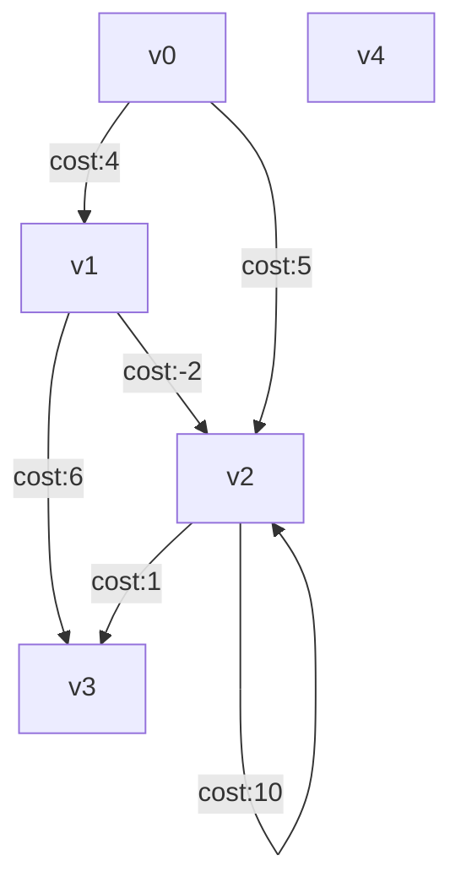

# Algorithms in javascript with simple example html to load and display interesting parts of the algorithms

## Running the examples

To run the html examples simply run live-server, e.g.

```npm install -g live-server```

```cd graphtheory```

```live-server depthFirstFunctional.html --browser="Google Chrome"```


## Some example graphs

The Depth First Algorithm Examples have this simple graph



ASCII Art (sucks)
```
    (v0)
    /  \
  4/    \5
  /      \
*        *
(v1)----*(v2)----|(v4)
  \  -2  / *_____|
  6\    /1    10
    \  /
     **
    (v3)
```          

## Testing

See https://www.alanwsmith.com/posts/how-to-use-jest-to-test-vanilla-javascript-files-without-a-framework--23yct7ahlbg3  for setting up Jest to run without npm
