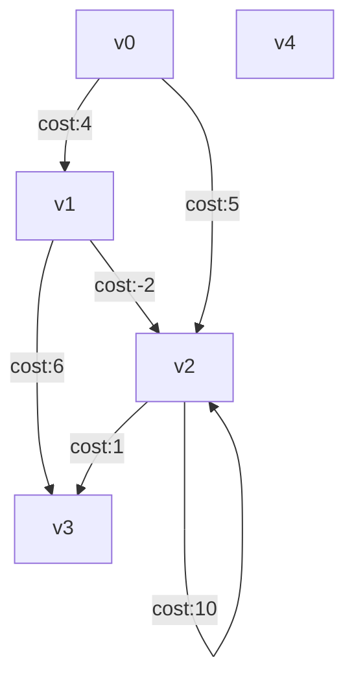

The Depth First Algorithm Examples have this simple graph



ASCII Art (sucks)
```
    (v0)
    /  \
  4/    \5
  /      \
*        *
(v1)----*(v2)----|(4)
  \  -2  / *_____|
  6\    /1    10
    \  /
     **
    (v3)
```            
